# План разработки Ball Survive

## Фаза 1: Подготовительный этап (1 день)

### Проектирование архитектуры:
- Детализация архитектуры
- Проектирование структуры проекта

### Настройка окружения:
- Создание репозиториев
- Подготовка шаблонов проектов
- Настройка системы документации

## Фаза 2: Разработка базового функционала (1-2 дня)

### Frontend разработка:
- Создание базовой структуры приложения
- Реализация компонентов:
  - Главное меню
  - Игровой процес

## Фаза 3: Разработка игровой механики (1-2 дня)

### Игровая логика:
- Передвижение игрока
- Двигающиеся убивающие игркоа полоски
- ПМеню паузы
- Механика таймера

### UI компоненты:
- Меню паузы
- Таймер

## Фаза 5: Подготовка к релизу (1 день)

### Документация:
- Руководство пользователя
- Техническая документация

## Временные рамки

Общая продолжительность разработки: 5-7 дней

- Подготовительный этап: 1 день
- Базовый функционал: 1-2 дня
- Игровая механика: 1-2 дня
- Дополнительный функционал: 1 день
- Подготовка к релизу: 1 день

# План разработки Ball Survive

## UML Диаграмма классов

```mermaid
classDiagram
    direction TB

    class Game {
        -player: Player
        -obstacles: Obstacle[]
        -timer: Timer
        -isGameOver: boolean
        +startGame(): void
        +endGame(): void
        +update(): void
        +render(): void
    }

    class Player {
        -position: Vector2
        -radius: number
        -color: string
        +move(direction: Vector2): void
        +checkCollision(obstacle: Obstacle): boolean
        +draw(): void
    }

    class Obstacle {
        -position: Vector2
        -size: Vector2
        -speed: number
        -color: string
        +update(): void
        +draw(): void
    }

    class Timer {
        -startTime: number
        -currentTime: number
        +start(): void
        +stop(): void
        +getElapsedTime(): number
    }

    class Vector2 {
        -x: number
        -y: number
    }

    class GameUI {
        -game: Game
        +showMainMenu(): void
        +showPauseMenu(): void
        +showGameOver(): void
        +drawTimer(): void
    }

    Game "1" *-- "1" Player
    Game "1" *-- "*" Obstacle
    Game "1" *-- "1" Timer
    Game "1" *-- "1" GameUI
    Player "1" *-- "1" Vector2
    Obstacle "1" *-- "1" Vector2
```

