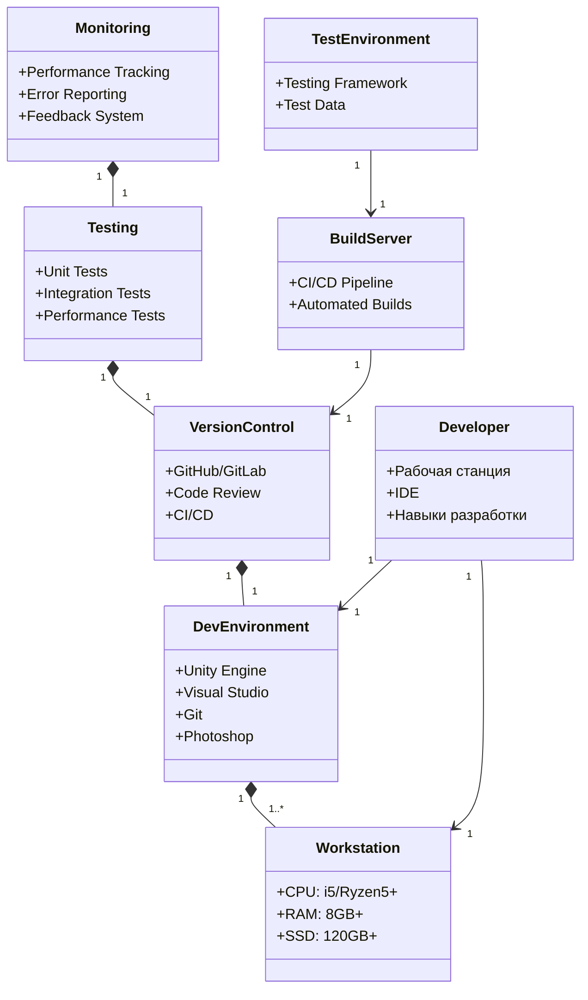

# План внедрения Ball Survive

## 1. Планирование и анализ требований (2-3 дня)

### Анализ технических требований:
- Определение стека технологий:
- Согласование списка необходимого ПО и оборудования с руководством
- Составление детального графика внедрения
- Определение критериев успешного внедрения

## 2. Подготовка инфраструктуры (2 дня)

### Настройка рабочих станций:
- Обеспечение разработчиков мощными рабочими станциями:
  - Минимум 8GB RAM
  - Процессор Intel Core i5/AMD Ryzen 5 или выше
  - SSD накопитель не менее 120GB
- Настройка доступа к серверам разработки и тестирования
- Проверка сетевой инфраструктуры

## 3. Установка и настройка ПО (2-3 дня)

### Среда разработки:
- Unity
- Photoshop

### Инструменты разработки:
- Visual Studio
- Git

## 4. Настройка среды разработки (2 дня)

### Конфигурация проекта:
- Настройка Unity

## 5. Обучение команды (3-4 дня)

### Технические тренинги:
- Обучение работе с Гтшен (3-4 дня)

### Процессы разработки:
- Code review
- Работа с Git
- Процедуры тестирования и деплоя

## 6. Тестирование и отладка (2-3 дня)

### Проверка окружения:
- Тестирование локальной среды разработки
- Тестирование процесса деплоя
- Проверка системы документации

## 7. Поддержка и мониторинг (Постоянно)

### Техническая поддержка:
- Мониторинг производительности
- Обновление компонентов системы
- Решение возникающих проблем
- Сбор обратной связи от команды

## Временные рамки

Общая продолжительность внедрения: 7 рабочих дней

- Планирование: 1 день
- Подготовка инфраструктуры: 1 день
- Установка ПО: 1 день
- Настройка среды: 1 день
- Обучение: 1-2 дня
- Тестирование: 1-2 дня

## Риски

### Возможные риски:
- Задержки в поставке оборудования
- Проблемы совместимости ПО
- Сопротивление команды новым процессам

### Меры по снижению рисков:
- Заблаговременный заказ оборудования
- Тестирование совместимости до внедрения
- Регулярные встречи с командой для обратной связи

# План внедрения Ball Survive

## UML Диаграмма развертывания и компонентов

